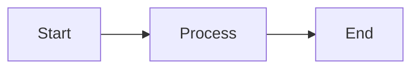

# MkDocs Documentation Setup Metaprompt

This metaprompt contains all instructions needed to recreate the MkDocs documentation configuration with a styled home landing page with cards and a labs page with table of contents and well-scoped side navigation.

## Project Overview

Create a Material for MkDocs documentation site with:
- Custom home landing page with card-based layout (no sidebars)
- Organized labs page with tables and structured navigation
- Forest green and royal purple color theme (light/dark modes)
- Responsive design with modern UI elements
- Navigation tabs and advanced features

## Installation & Dependencies

### 1. Install MkDocs with Material Theme

```bash
pip install mkdocs-material
```

### 2. Project Structure

Create the following directory structure:

```
project-root/
├── mkdocs.yml                      # Main configuration file
├── docs/
│   ├── index.md                    # Home page content
│   ├── overrides/
│   │   └── home.html              # Custom home page template
│   ├── stylesheets/
│   │   └── extra.css              # Custom styling
│   ├── getting-started/
│   │   ├── setup.md
│   │   └── quickstart.md
│   ├── labs/
│   │   ├── index.md               # Labs overview with tables
│   │   └── [lab files].md
│   └── api/
│       └── [api docs].md
└── site/                          # Generated output (add to .gitignore)
```

## Configuration Files

### 1. mkdocs.yml - Main Configuration

Create `mkdocs.yml` in the project root with:

```yaml
site_name: Your Project Name
site_description: Your project description
site_author: Your Name/Team

theme:
  name: material
  custom_dir: docs/overrides
  
  palette:
    # Light mode - Forest Green theme
    - media: "(prefers-color-scheme: light)"
      scheme: default
      primary: green
      accent: deep purple
      toggle:
        icon: material/brightness-7
        name: Switch to dark mode
    
    # Dark mode - Royal Purple theme
    - media: "(prefers-color-scheme: dark)"
      scheme: slate
      primary: green
      accent: deep purple
      toggle:
        icon: material/brightness-4
        name: Switch to light mode
  
  features:
    - navigation.tabs           # Top-level tabs
    - navigation.sections       # Grouped sections
    - navigation.expand         # Auto-expand sections
    - navigation.top            # Back-to-top button
    - navigation.tracking       # Anchor tracking
    - search.suggest            # Search suggestions
    - search.highlight          # Highlight search terms
    - search.share              # Share search results
    - content.code.copy         # Copy code button
    - content.code.annotate     # Code annotations
    - content.tabs.link         # Linked content tabs
  
  icon:
    repo: fontawesome/brands/github
  
  font:
    text: Roboto
    code: Roboto Mono

extra_css:
  - stylesheets/extra.css

markdown_extensions:
  # Code highlighting
  - pymdownx.highlight:
      anchor_linenums: true
      line_spans: __span
      pygments_lang_class: true
  - pymdownx.inlinehilite
  - pymdownx.snippets
  - pymdownx.superfences:
      custom_fences:
        - name: mermaid
          class: mermaid
          format: !!python/name:pymdownx.superfences.fence_code_format
  
  # Admonitions (callout boxes)
  - admonition
  - pymdownx.details
  
  # Other extensions
  - pymdownx.tabbed:
      alternate_style: true
  - pymdownx.tasklist:
      custom_checkbox: true
  - pymdownx.emoji:
      emoji_index: !!python/name:material.extensions.emoji.twemoji
      emoji_generator: !!python/name:material.extensions.emoji.to_svg
  - attr_list
  - md_in_html
  - def_list
  - tables
  - footnotes
  - meta
  - toc:
      permalink: true

plugins:
  - search:
      separator: '[\s\-,:!=\[\]()"`/]+|\.(?!\d)|&[lg]t;|(?!\b)(?=[A-Z][a-z])'

nav:
  - Home: index.md
  - Getting Started:
    - Setup: getting-started/setup.md
    - Quick Start: getting-started/quickstart.md
  - Labs:
    - Overview: labs/index.md
    - Core Fundamentals:
      - Lab 01 - Basic: labs/01-basic.md
      - Lab 02 - CRUD: labs/02-crud.md
    - Advanced Topics:
      - Lab 03 - Advanced: labs/03-advanced.md
  - API Reference:
    - Overview: api/index.md

extra:
  social:
    - icon: fontawesome/brands/github
      link: https://github.com/your-org/your-repo
  generator: false  # Remove "Made with Material for MkDocs"
```

### 2. docs/overrides/home.html - Custom Home Template

Create `docs/overrides/home.html` to hide sidebars on home page only:

```html



{{ super() }}
<style>
  .md-sidebar--primary {
    display: none;
  }
  .md-sidebar--secondary {
    display: none !important;
  }
  .md-content {
    max-width: 100%;
    margin: 0 auto;
  }
  .md-main__inner {
    margin: 0;
    max-width: 100%;
  }
  .md-content__inner {
    margin: 0 auto;
    max-width: 100%;
    padding: 2rem;
  }
  
  /* Container for hero and labs with responsive max-width */
  .hero-banner,
  .labs-grid {
    max-width: 1400px;
    margin-left: auto;
    margin-right: auto;
  }
  
  /* Responsive padding */
  @media screen and (max-width: 768px) {
    .md-content__inner {
      padding: 1rem;
    }
  }
</style>



  <!-- Hide navigation sidebar on home page -->



  <!-- Hide TOC sidebar on home page -->



<div class="hero-banner">
  <h3>Learning Objectives</h3>
  <ul class="objectives-list">
    <li>First key learning objective</li>
    <li>Second key learning objective</li>
    <li>Third key learning objective</li>
  </ul>
</div>

<div class="labs-grid">
  <a href="labs/01-basic/" class="lab-card">
    <div class="lab-number">01</div>
    <h3>First Lab Title</h3>
    <p>Brief description of what this lab covers</p>
  </a>
  
  <a href="labs/02-crud/" class="lab-card">
    <div class="lab-number">02</div>
    <h3>Second Lab Title</h3>
    <p>Brief description of what this lab covers</p>
  </a>
  
  <!-- Add more lab cards as needed -->
</div>

```

**Key Points:**
- Extends Material's `main.html` template
- Hides both sidebars on home page only
- Centers content with max-width containers
- Uses custom CSS classes (`.hero-banner`, `.labs-grid`, `.lab-card`)

### 3. docs/stylesheets/extra.css - Custom Styling

Create `docs/stylesheets/extra.css` with complete styling:

```css
/* ============================================
   HERO/BANNER SECTION - Learning Objectives
   ============================================ */

.hero-banner {
  background: #2e7d32;           /* Forest green */
  color: white;
  padding: 1.5rem 2rem;
  text-align: left;
  border-radius: 6px;
  margin-bottom: 2rem;
  box-shadow: 0 2px 8px rgba(46, 125, 50, 0.3);
}

[data-md-color-scheme="slate"] .hero-banner {
  background: #6a1b9a;           /* Royal purple */
  color: #81c784;                /* Light green */
  box-shadow: 0 2px 8px rgba(106, 27, 154, 0.4);
}

.hero-banner h3 {
  font-size: 1.25rem;
  font-weight: 600;
  margin: 0 0 0.75rem 0;
  color: white;
}

[data-md-color-scheme="slate"] .hero-banner h3 {
  color: #c5e1a5;
}

.hero-banner .objectives-list {
  list-style: none;
  padding: 0;
  margin: 0;
  display: grid;
  grid-template-columns: repeat(auto-fit, minmax(300px, 1fr));
  gap: 0.5rem;
}

.hero-banner .objectives-list li {
  font-size: 0.95rem;
  padding-left: 1.5rem;
  position: relative;
  color: white;
  line-height: 1.5;
}

.hero-banner .objectives-list li::before {
  content: "✓";
  position: absolute;
  left: 0;
  font-weight: bold;
  color: #c5e1a5;
}

[data-md-color-scheme="slate"] .hero-banner .objectives-list li {
  color: #ffffff;
}

[data-md-color-scheme="slate"] .hero-banner .objectives-list li::before {
  color: #a5d6a7;
}

/* ============================================
   LABS GRID - Compact Cards
   ============================================ */

.labs-grid {
  display: grid;
  grid-template-columns: repeat(auto-fill, minmax(280px, 1fr));
  gap: 1.25rem;
  margin: 2rem 0;
}

.lab-card {
  display: block;
  padding: 1.25rem;
  background: #f1f8e9;            /* Light green tint */
  border-radius: 8px;
  border-left: 4px solid #2e7d32; /* Forest green */
  text-decoration: none;
  color: #000000;
  transition: all 0.3s ease;
  position: relative;
  box-shadow: 0 2px 8px rgba(46, 125, 50, 0.15);
}

[data-md-color-scheme="slate"] .lab-card {
  background: #4a148c;            /* Deep purple */
  border-left-color: #81c784;     /* Light green */
  color: #ffffff;
}

.lab-card:hover {
  transform: translateY(-4px);
  box-shadow: 0 8px 20px rgba(46, 125, 50, 0.3);
  border-left-width: 6px;
  background: #e8f5e9;
}

[data-md-color-scheme="slate"] .lab-card:hover {
  box-shadow: 0 8px 20px rgba(129, 199, 132, 0.4);
  background: #6a1b9a;            /* Royal purple */
}

.lab-number {
  position: absolute;
  top: 0.75rem;
  right: 0.75rem;
  font-size: 0.75rem;
  font-weight: 700;
  color: #ffffff;
  background: #6a1b9a;            /* Royal purple */
  padding: 0.25rem 0.5rem;
  border-radius: 4px;
}

[data-md-color-scheme="slate"] .lab-number {
  color: #1b5e20;
  background: #81c784;
}

.lab-card h3 {
  color: #2e7d32;
  margin: 0 0 0.5rem 0;
  font-size: 1.1rem;
  font-weight: 600;
  padding-right: 3rem;            /* Space for lab number */
}

[data-md-color-scheme="slate"] .lab-card h3 {
  color: #81c784;
}

.lab-card p {
  margin: 0;
  font-size: 0.875rem;
  opacity: 0.85;
  line-height: 1.5;
  color: #000000;
}

[data-md-color-scheme="slate"] .lab-card p {
  color: #ffffff;
}

.lab-card:hover h3 {
  color: #1b5e20;
}

[data-md-color-scheme="slate"] .lab-card:hover h3 {
  color: #a5d6a7;
}

/* ============================================
   HEADER/NAVIGATION BAR
   ============================================ */

.md-header {
  background-color: #2e7d32 !important;  /* Forest green */
  color: white !important;
}

[data-md-color-scheme="slate"] .md-header {
  background-color: #6a1b9a !important;  /* Royal purple */
  color: #81c784 !important;
}

.md-header__title {
  color: white !important;
}

[data-md-color-scheme="slate"] .md-header__title {
  color: #81c784 !important;
}

.md-header__button {
  color: white !important;
}

[data-md-color-scheme="slate"] .md-header__button {
  color: #81c784 !important;
}

/* Navigation tabs */
.md-tabs {
  background-color: #1b5e20 !important;  /* Darker green */
}

[data-md-color-scheme="slate"] .md-tabs {
  background-color: #4a148c !important;  /* Deep purple */
}

.md-tabs__link {
  color: rgba(255, 255, 255, 0.7) !important;
}

.md-tabs__link--active,
.md-tabs__link:hover {
  color: white !important;
}

[data-md-color-scheme="slate"] .md-tabs__link {
  color: rgba(129, 199, 132, 0.7) !important;
}

[data-md-color-scheme="slate"] .md-tabs__link--active,
[data-md-color-scheme="slate"] .md-tabs__link:hover {
  color: #a5d6a7 !important;
}

/* ============================================
   SEARCH BAR
   ============================================ */

.md-search__input {
  background-color: rgba(255, 255, 255, 0.1) !important;
  border: 1px solid rgba(255, 255, 255, 0.2) !important;
  color: white !important;
  border-radius: 4px;
}

.md-search__input::placeholder {
  color: rgba(255, 255, 255, 0.6) !important;
}

[data-md-color-scheme="slate"] .md-search__input {
  background-color: rgba(129, 199, 132, 0.1) !important;
  border: 1px solid rgba(129, 199, 132, 0.2) !important;
  color: #81c784 !important;
}

[data-md-color-scheme="slate"] .md-search__input::placeholder {
  color: rgba(129, 199, 132, 0.6) !important;
}

/* ============================================
   NAVIGATION SIDEBAR
   ============================================ */

.md-nav__link--active {
  color: #2e7d32 !important;
}

[data-md-color-scheme="slate"] .md-nav__link--active {
  color: #81c784 !important;
}

.md-nav__title {
  font-weight: 600;
}

/* ============================================
   CODE BLOCKS & ADMONITIONS
   ============================================ */

.highlight pre {
  border-radius: 4px;
}

.admonition {
  border-radius: 4px;
  box-shadow: 0 2px 4px rgba(0, 0, 0, 0.05);
}

[data-md-color-scheme="slate"] .admonition {
  box-shadow: 0 2px 4px rgba(0, 0, 0, 0.2);
}

/* ============================================
   SMOOTH SCROLLING
   ============================================ */

html {
  scroll-behavior: smooth;
}
```

**Color Palette:**
- Light Mode: Forest Green (#2e7d32, #1b5e20) with Deep Purple accent (#6a1b9a)
- Dark Mode: Royal Purple (#6a1b9a, #4a148c) with Light Green accent (#81c784)

### 4. docs/index.md - Home Page Content

Create `docs/index.md` with frontmatter to use custom template:

```markdown
---
template: home.html
---

## Welcome to Your Project

Brief introduction to your documentation.

### What's New

!!! info "Note"
    Use admonitions for callouts and important information.

The key features of your project:

- **Feature One**: Description
- **Feature Two**: Description
- **Feature Three**: Description

### Quick Links

=== "Installation"

    ```bash
    # Installation commands
    pip install your-package
    ```

=== "Verify"

    ```bash
    # Verification commands
    your-command --version
    ```

### Getting Started

Follow these steps to get up and running:

1. **[Setup Environment](getting-started/setup.md)** - Install and configure
2. **[Quick Start Guide](getting-started/quickstart.md)** - Build your first project
3. **[Explore Labs](labs/)** - Work through hands-on exercises

### Hands-On Labs

<div class="grid cards" markdown>

- :material-rocket-launch: **Lab 01: Getting Started**

    ---
    
    Brief description of lab content
    
    [:octicons-arrow-right-24: Start Lab](labs/01-basic.md)

- :material-robot: **Lab 02: Intermediate**

    ---
    
    Brief description of lab content
    
    [:octicons-arrow-right-24: Start Lab](labs/02-crud.md)

- :material-database-edit: **Lab 03: Advanced**

    ---
    
    Brief description of lab content
    
    [:octicons-arrow-right-24: Start Lab](labs/03-advanced.md)

</div>

[View All Labs →](labs/){ .md-button }

---

Ready to get started? [Begin now →](getting-started/setup.md){ .md-button .md-button--primary }
```

**Key Elements:**
- Frontmatter: `template: home.html` to use custom template
- Material icons: `:material-icon-name:`
- Octicons: `:octicons-icon-name:`
- Tabbed content: `=== "Tab Title"`
- Grid cards: `<div class="grid cards" markdown>`
- Admonitions: `!!! type "Title"`
- Buttons: `[Text](link){ .md-button }`

### 5. docs/labs/index.md - Labs Overview Page

Create `docs/labs/index.md` with organized tables:

```markdown
# Labs

Hands-on exercises to learn step-by-step.

## Getting Started

Before starting the labs, ensure you've completed the [setup](../getting-started/setup.md).

## Lab Catalog

Work through these labs sequentially to build your skills.

### Core Fundamentals

| Lab | Title | Topics Covered | Difficulty |
|-----|-------|----------------|------------|
| [01](01-basic.md) | **Basic Concepts** | Introduction, fundamentals | 🟢 Beginner |
| [02](02-crud.md) | **CRUD Operations** | Create, Read, Update, Delete | 🟢 Beginner |
| [03](03-intermediate.md) | **Intermediate Topics** | Advanced concepts | 🟡 Intermediate |

### Advanced Topics

| Lab | Title | Topics Covered | Difficulty |
|-----|-------|----------------|------------|
| [04](04-advanced.md) | **Advanced Features** | Complex workflows | 🟠 Advanced |
| [05](05-expert.md) | **Expert Level** | Production patterns | 🔴 Expert |

### Additional Resources

| Lab | Title | Topics Covered | Difficulty |
|-----|-------|----------------|------------|
| [06](06-bonus.md) | **Bonus Content** | Extra material | 🟡 Intermediate |

## Navigation Tips

- Use the **sidebar** to jump between labs
- Each lab includes **objectives**, **prerequisites**, and **steps**
- Code samples are provided with **copy buttons**
- Look for **admonitions** highlighting important notes

## Progress Tracking

!!! tip "Recommended Path"
    Complete labs in numerical order for the best learning experience.

---

[Back to Home](../){ .md-button }
```

**Key Features:**
- Organized tables grouping labs by category
- Difficulty indicators with emojis (🟢🟡🟠🔴)
- Internal links to individual lab pages
- Clear section headers for navigation
- Admonitions for tips and guidance

## Building and Serving

### Local Development

```bash
# Serve with live reload
mkdocs serve

# Access at http://127.0.0.1:8000
```

### Build Static Site

```bash
# Build to site/ directory
mkdocs build

# Add site/ to .gitignore
echo "site/" >> .gitignore
```

### Deploy to GitHub Pages

```bash
# Deploy to gh-pages branch
mkdocs gh-deploy
```

## Navigation Structure Best Practices

### Well-Scoped Side Navigation

The `nav` section in `mkdocs.yml` creates the sidebar structure:

```yaml
nav:
  - Home: index.md
  - Getting Started:          # Top-level section (collapsible)
    - Setup: getting-started/setup.md
    - Quick Start: getting-started/quickstart.md
  - Labs:                     # Top-level section
    - Overview: labs/index.md
    - Core Fundamentals:      # Nested subsection (grouped)
      - Lab 01: labs/01-basic.md
      - Lab 02: labs/02-crud.md
    - Advanced Topics:        # Nested subsection
      - Lab 03: labs/03-advanced.md
```

**Tips:**
- Keep hierarchy to 2-3 levels maximum
- Group related content under sections
- Use clear, descriptive names
- Order logically (beginner to advanced)

## Responsive Design

The configuration includes responsive features:

- Grid layouts adjust to screen size with `auto-fit` and `minmax`
- Media queries for mobile (`@media screen and (max-width: 768px)`)
- Touch-friendly card sizes and spacing
- Readable font sizes on all devices

## Icon Usage

Material for MkDocs supports multiple icon sets:

```markdown
:material-rocket-launch:    # Material Design Icons
:octicons-arrow-right-24:   # GitHub Octicons
:fontawesome-brands-github: # Font Awesome
```

Browse icons:
- Material: https://squidfunk.github.io/mkdocs-material/reference/icons-emojis/
- Search: https://squidfunk.github.io/mkdocs-material/reference/icons-emojis/#search

## Advanced Features

### Code Annotations

```python
def hello():
    print("Hello")  # (1)!
```

1. This is a code annotation

### Mermaid Diagrams



### Tabbed Content

```markdown
=== "Python"
    ```python
    print("Hello")
    ```

=== "JavaScript"
    ```javascript
    console.log("Hello");
    ```
```

### Task Lists

```markdown
- [x] Completed task
- [ ] Incomplete task
```

## Customization Checklist

To adapt this setup to your project:

- [ ] Update `site_name`, `site_description`, `site_author` in `mkdocs.yml`
- [ ] Modify color scheme in `extra.css` if desired
- [ ] Update `docs/index.md` with your content and lab cards
- [ ] Create lab files in `docs/labs/`
- [ ] Update `docs/labs/index.md` with your lab tables
- [ ] Customize `docs/overrides/home.html` with your hero content
- [ ] Update navigation structure in `mkdocs.yml`
- [ ] Replace placeholder links and content
- [ ] Add your logo/favicon (optional)
- [ ] Configure repository link in `extra.social`

## File Checklist

Ensure all these files exist:

```
✓ mkdocs.yml
✓ docs/index.md
✓ docs/overrides/home.html
✓ docs/stylesheets/extra.css
✓ docs/labs/index.md
✓ .gitignore (with site/ entry)
```

## Testing

Before deploying, verify:

1. **Local build works**: `mkdocs build` runs without errors
2. **All links resolve**: No broken internal links
3. **Navigation works**: Sidebar shows all sections correctly
4. **Search functions**: Search bar finds content
5. **Dark mode**: Toggle between light/dark themes
6. **Responsive**: Test on mobile viewport
7. **Code copy**: Copy buttons work on code blocks

## Common Issues & Solutions

### Issue: Custom template not loading
**Solution**: Ensure `custom_dir: docs/overrides` in `mkdocs.yml` and file exists at `docs/overrides/home.html`

### Issue: CSS not applying
**Solution**: Check `extra_css: - stylesheets/extra.css` in config and file at `docs/stylesheets/extra.css`

### Issue: Icons not showing
**Solution**: Verify emoji extension is enabled in `markdown_extensions`

### Issue: Sidebar shows on home page
**Solution**: Confirm frontmatter `template: home.html` in `docs/index.md`

### Issue: Cards don't display
**Solution**: Ensure `md_in_html` and `attr_list` extensions are enabled

## Reference Links

- Material for MkDocs: https://squidfunk.github.io/mkdocs-material/
- MkDocs Documentation: https://www.mkdocs.org/
- Material Reference: https://squidfunk.github.io/mkdocs-material/reference/
- Markdown Extensions: https://facelessuser.github.io/pymdown-extensions/

---

**End of Metaprompt**

Use this document to recreate a fully-configured MkDocs site with:
✓ Custom home page with card layout (no sidebars)
✓ Organized labs page with tables and sections
✓ Forest green/royal purple color theme (light/dark)
✓ Well-structured navigation with tabs and sections
✓ Modern, responsive design with all Material features
