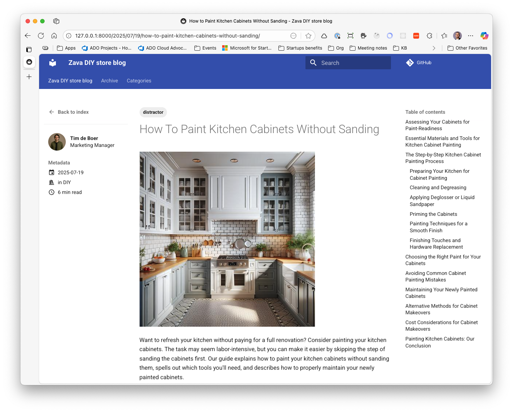

# Zava's DIY Knowledge Hub 🛠️

Welcome to the **Zava DIY Store Knowledge Blog** - your ultimate resource for DIY projects, painting techniques, and tool expertise! This collection represents the collective wisdom of Zava's expert team, sharing practical knowledge to help DIY enthusiasts tackle their projects with confidence.


*The Zava DIY Knowledge Hub - Your go-to resource for expert DIY guidance and techniques*

## About Zava's Knowledge Blog

Zava has been empowering DIY enthusiasts with high-quality tools and expert guidance. Our blog articles are written by our experienced team members who understand both the art and science of DIY projects. From weekend warriors to professional contractors, we provide the insights you need to get the job done right.

### Our Expertise Areas

**🎨 Painting & Finishing**
- Interior and exterior painting techniques
- Furniture refinishing and restoration
- Chalk paint and specialty finishes
- Professional spraying techniques

**🔨 Tool Guidance**
- Hand tool selection and usage
- Power tool best practices
- Safety tips and techniques
- Maintenance and care

**🏠 Home Improvement Projects**
- Kitchen cabinet painting
- Outdoor furniture restoration
- Floor refinishing
- Garden furniture care

## Content Structure

This knowledge base is organized as a **MkDocs-powered blog** with the following structure:

```
data/articles/
├── README.md           # This file
├── mkdocs.yml         # MkDocs configuration
├── requirements.txt   # Python dependencies
└── docs/
    ├── index.md       # Blog homepage
    ├── posts/         # Individual blog articles (Markdown)
    ├── posts-pdf/     # PDF versions of articles
    ├── images/        # Full-size images
    ├── images-640x480/# Optimized images
    ├── avatars/       # Author profile photos
    └── avatars-640x480/# Optimized avatars
```

## Article Collection

Our knowledge base contains **15 comprehensive guides** covering:

### Painting Projects
- **Garden & Outdoor Furniture**: Benches, patio furniture, plastic chairs
- **Kitchen Projects**: Cabinet painting with and without sanding
- **Specialty Techniques**: Chalk paint, wood floor painting
- **Children's Projects**: Safe painting techniques for wooden toys

### Expert Contributors


*Meet the Zava DIY experts who create our comprehensive guides*

Our articles are written by Zava's expert team:
- **Cecil Folk** - Garden furniture specialist
- **Miguel Garcia** - Chalk paint expert and video tutorial creator

## Using This Knowledge Base

### For Developers
This collection serves as training data for AI models, providing:
- **Structured Content**: Markdown format with YAML frontmatter
- **Categorized Topics**: Organized by DIY categories and tags
- **Multi-format Support**: Both web-ready and PDF versions
- **Rich Media**: Images and author profiles included

### For Content Creation
Articles include:
- **SEO-optimized titles** and descriptions
- **Step-by-step instructions** with tool recommendations
- **Product recommendations** from Zava's catalog
- **Professional tips** from experienced DIYers

### For Training AI Models
Perfect for:
- **Fine-tuning** models on DIY and home improvement topics
- **Question-answering** systems about painting and tools
- **Product recommendation** engines
- **Instructional content** generation

## Article Topics Overview

| Date Range | Focus Areas |
|------------|-------------|
| **2024 Q1** | Garden furniture painting, cabinet refinishing |
| **2024 Q2-Q3** | Outdoor wood furniture, chalk painting basics |
| **2024 Q4** | Metal furniture, plastic chair restoration |
| **2025 Q1-Q2** | Advanced techniques, outdoor durability |
| **2025 Q3** | Children's projects, professional methods |

## Getting Started

To build and serve this knowledge base locally:

```bash
cd data/articles
pip install -r requirements.txt
mkdocs serve
```

Visit the live blog at `http://localhost:8000` to explore all articles with full formatting, images, and navigation.

---

**Zava DIY Store** - *Empowering your DIY journey with quality tools and expert knowledge since day one.* 

*Need help with your next project? Our articles provide the guidance, and our tools provide the quality to make it happen!*